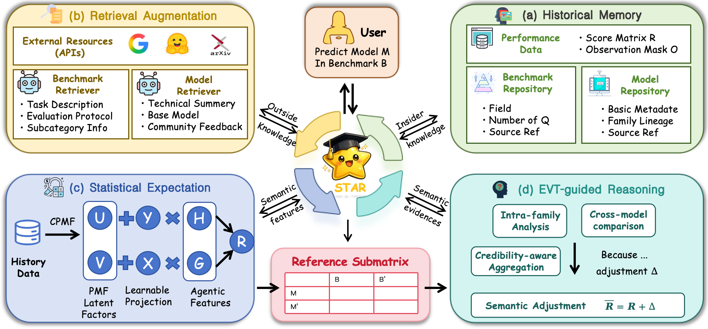

# STAR: Bridging Statistical and Agentic Reasoning for Large Model Performance Prediction

<p align="center">
  <a href="https://arxiv.org/abs/2602.12143"></a>
  <a href="https://github.com/xiaoxiaostudy/star"></a>
  <a href="https://www.python.org/downloads/release/python-3100/"></a>
</p>

> **STAR** (**S**emantic-enhanced **T**wo-stage **A**gent for model pe**R**formance prediction) bridges data-driven **ST**atistical expectations with knowledge-driven **A**gentic **R**easoning to predict LLM benchmark performance from extremely sparse observations.

<p align="center">
  
</p>

## ✨ Highlights

- 🎯 **Extreme sparsity**: With only 1–2 observed scores per test model (95% masking), STAR improves overall score by **14.46%** over the strongest statistical baseline.
- 🔀 **Distribution shift**: Under benchmark-side OOD scenarios, STAR outperforms PMF by **43.66** overall score points where pure statistical methods completely fail.
- 🔍 **Interpretability**: Every prediction comes with a traceable evidence chain — intra-family architecture analysis, cross-model comparison, and credibility-weighted aggregation.
- 🧠 **EVT-guided reasoning**: First framework to adopt **Expectancy Violation Theory** from cognitive science to fuse statistical expectations with agentic reasoning.

## 📐 Framework Overview

STAR consists of four modules:

| Module | Description |
|---|---|
| **Historical Memory** | Maintains the observed score matrix and structured model/benchmark profiles |
| **Retrieval Augmentation** | Collects external knowledge from HuggingFace, arXiv, and Google via dedicated agents |
| **Statistical Expectation** | CPMF (Constrained Probabilistic Matrix Factorization) with MCMC uncertainty estimation |
| **EVT-guided Reasoning** | Two-step analysis (intra-family + cross-model) with credibility-aware aggregation |

## 📁 Project Structure

```
STAR/
├── test_evt_agent.py          # Main pipeline: evidence extraction → CPMF → semantic adjustment
├── agents/
│   ├── benchmark_agent.py     # BenchmarkAgent: collects benchmark info (HuggingFace / arXiv / Google)
│   └── model_agent.py         # ModelAgent: collects model & family info (tech summary + community feedback)
├── crosspred/
│   ├── run_cpmf_vlm.py        # CPMF training & evaluation script
│   ├── method/
│   │   ├── pmf.py             # PMF (Probabilistic Matrix Factorization)
│   │   ├── pmf_with_profile.py # CPMF (Constrained PMF with feature profiles)
│   │   └── baseline_pmf.py    # Baseline methods (UniformRandom / GlobalMean / MeanOfMeans)
│   └── utils/
│       └── metric.py          # RMSE and evaluation utilities
├── data/
│   ├── datadown.py            # Download OpenCompass VLM Leaderboard data
│   ├── gen_databases.py       # Generate model features / knowledge databases
│   └── split_data.py          # Split train/test sets for PMF
├── data_sources/
│   └── async_fetcher.py       # Async concurrent web fetcher with caching & Jina AI support
├── requirements.txt
├── .env.example               # Environment variable template
└── README.md
```

## 🚀 Quick Start

### 1. Install Dependencies

```bash
conda create -n star python=3.10 -y
conda activate star
pip install -r requirements.txt
```

### 2. Configure Environment Variables

Copy `.env.example` to `.env` and fill in your API keys:

```bash
cp .env.example .env
```

```bash
# Required
export OPENAI_API_KEY="your_openai_api_key"

# Optional: custom base URL (for compatible APIs)
export OPENAI_BASE_URL="https://api.openai.com/v1"

# Optional: LLM model
export LLM_MODEL="gpt-4o"

# Optional: for web search augmentation
export GOOGLE_API_KEY="your_google_api_key"
export GOOGLE_CSE_ID="your_google_cse_id"

# Optional: for better JS-rendered page fetching
export JINA_API_KEY="your_jina_api_key"
```

### 3. Prepare Data

**Step 1**: Download OpenCompass VLM Leaderboard score matrix:

```bash
python data/datadown.py
```

**Step 2**: Generate model features database (no LLM needed, only HuggingFace API access):

```bash
python data/gen_databases.py build-features
```

This downloads model metadata from OpenCompass, matches HuggingFace/arXiv links, extracts model families, and generates `models_features_db.json`.

**Step 3**: Generate benchmark features database (requires LLM API):

```bash
python data/gen_databases.py build-benchmarks
```

This uses `BenchmarkAgent` to collect task descriptions, categories, and subcategories for each benchmark → `benchmark_features_db.json`.

**Step 4**: Generate model knowledge database (requires LLM API):

```bash
python data/gen_databases.py build-knowledge
```

This uses `ModelAgent` to generate technical summaries and community feedback for each model family → `models_knowledge_db.json`.

**Step 5** (Optional): Generate component knowledge databases:

```bash
python data/gen_databases.py build-components
```

This generates `vision_model_knowledge_db.json` and `language_model_knowledge_db.json`.

> **Tip**: Run `python data/gen_databases.py all` to execute all steps at once.

**Step 6**: Split train/test sets for PMF (models released after `cutoff_date` are split):

```bash
# Default: cutoff=2025/01/01, test_ratio=0.4
python data/split_data.py

# Custom split ratio
python data/split_data.py --test_ratio 0.6 --cutoff_date 2025/01/01
```

This generates `train_data_wide_{RATE}.csv` and `test_data_wide_{RATE}.csv` in `data/opencompass_cache/`.

All generated files will be saved to `data/opencompass_cache/`.

### 4. Run STAR

```bash
# Basic run
python test_evt_agent.py

# Limit sample count (for quick testing)
python test_evt_agent.py --max_samples 10

# Parallel batched run
python test_evt_agent.py --batch_id 0 --total_batches 4
python test_evt_agent.py --batch_id 1 --total_batches 4
python test_evt_agent.py --batch_id 2 --total_batches 4
python test_evt_agent.py --batch_id 3 --total_batches 4
```

## 📊 Evaluation Metrics

STAR evaluates predictions using five standard metrics:

| Metric | Type | Direction | Description |
|---|---|---|---|
| **MAE** | Score-loss | ↓ Lower is better | Mean Absolute Error (normalized 0–100) |
| **RMSE** | Score-loss | ↓ Lower is better | Root Mean Squared Error (normalized 0–100) |
| **SRCC** | Rank | ↑ Higher is better | Spearman Rank Correlation Coefficient |
| **KRCC** | Rank | ↑ Higher is better | Kendall Rank Correlation Coefficient |
| **MAE@3** | Rank | ↑ Higher is better | Fraction of predictions with rank error ≤ 3 |

## 🔧 Key Components

### BenchmarkAgent

Collects benchmark information with the following priority:
1. **HuggingFace Datasets API** — dataset config, README
2. **arXiv** — extract paper ID from README, fetch abstract
3. **Google Search** — fallback when not found on HuggingFace
4. **LLM extraction** — structured summarization of collected content

### ModelAgent

Two-level information collection:
- **Family level** (`FamilyFeatures`): technical summary + community sentiment (web search)
- **Model level** (`ModelFeatures`): architecture details, parameters, release date

### Semantic Adjustment (EVT-guided)

Two-step reasoning:
1. **Intra-family evolution analysis**: architecture changes and performance trends within the model family
2. **Cross-model comparison**: multi-dimensional comparison with rank-similar models (organization, architecture, parameters, release date)

Final prediction = CPMF statistical expectation + credibility-weighted adjustment Δ

## 📝 Citation

```bibtex
@article{star2026,
  title={STAR: Bridging Statistical and Agentic Reasoning for Large Model Performance Prediction},
  journal={arXiv preprint arXiv:2602.12143},
  year={2026}
}
```

## 📄 Related Work

- [Can We Predict Performance of Large Models across Vision-Language Tasks?](https://arxiv.org/abs/2410.10112) (arXiv: 2410.10112)
- [Redundancy Principles for MLLMs Benchmarks](https://arxiv.org/abs/2501.13953) (arXiv: 2501.13953)

## License

This project is licensed under the MIT License.
